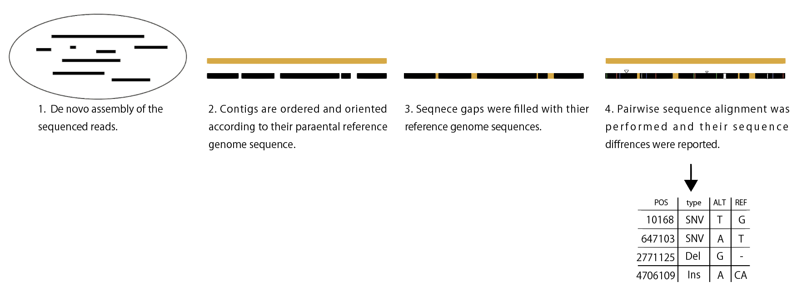

######################################################################################## 
pseudo_complete_genome_builder 0.6

A Perl scripts to create pseudo complete genome from fragmented sequences(contigs).   

pseudo_complete_genome_builder: 

Kazuma Uesaka, and Kunio Ihara  


Input: 
  Complete reference genome(fasta) and contig or scaffolds(fasta)
Outnput:	
  complete genome sequeces that are ordered and oriented by the reference genome sequences

Usage:  
  perl pseudo_complete_genome_builder_v0.6.pl


########################################################################################

    
## Requirements  
- SAMTools  
- minimap2 and patools utility
- seqkit 
- EMBOSS package seqret command

Install Anaconda3 or Miniconda3. Then,  
```
git clone git@github.com:kazumaxneo/pseudo_complete_genome_builder.git
cd pseudo_complete_genome_builder/
conda env create -f=env.yaml
conda activate pseudo_complete_genome_builder_v0.6
perl pseudo_complete_genome_builder_v0.6.pl
```
    


## create pseundo complete genome. If you uses spades assembler for de novo assembly, type
```
perl pseudo_complete_genome_builder_v0.6.pl -f reference.fasta -s scaffolds.fasta -max 50 -min 40 -n 1 -p 3000 -l 3000 -t 150 -a spades
```

## create pseundo complete genome. If you uses unicycler assembler for de novo assembly, type
```
perl pseudo_complete_genome_builder_v0.6.pl -f reference.fasta -s assembly.fasta -max 1.1 -min 0.9 -n 1 -p 3000 -l 3000 -t 150 -a unicycler
```

```
Input/output options:
	-f	reference fasta (Required)
	-s	contigs/scaffolds (Required)
	-max	coverage max (Required)
	-min	coverage minimum (Required)
	-l	minimum contig length (bp) (default: 3000)
	-g	minimum alignment paf (bp) (default: 3000)
	-n	reference chromosome number (max 2) (default: 1)
	-t	trimmng size from both ends of assembly (default: 150)
	-a <spades|unicycler>	assembler (default: spades)
```

## Test run
```
cd test/
perl ../pseudo_complete_genome_builder_v0.6.pl -f reference.fa -s contigs.fasta -max 30 -min 15 -n c1 -p 3000 -l 3000 -t 150 -a spades
```  

First, pseudo complete genome was created, then thier pairwise seuqence alignment was performed with minimap2. Finally, their sequence difference, including SNVs, small indels, and large indels, was called with paftools.
<p align="center"></p>


## Licence ##

GPL v3.


